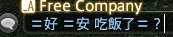
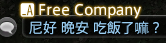

# NoMoreEquals

將遊戲內**聊天打字**中的缺失中文字符替換為日文漢字異體字的 Dalamud 插件，目前僅支援繁體中文轉換。

讓全世界沒有裝中文包的人也能看到你在寫什麼。

Dalamud plugin that replaces Chinese characters missing from FFXIV’s AXIS UI font with Japanese kanji **while you type in chat**.

Examples (when AXIS lacks the Chinese form):

| Input | Output |
| --- | --- |
| 綠 | 緑 |
| 黑 | 黒 |
| 每 | 毎 |

Characters are non-common Kanji but frequently used in Traditional Chinese, which already exist in AXIS (e.g. 圖, 邊, 國, 學) are **not** converted.

非日文常用漢字，但是有內建在遊戲內字體(AXIS)的常用繁體中文字(e.g. 圖, 邊, 國, 學)依舊**不會**被轉換。

## Why glyph mappings 為什麼要字符轉換

FFXIV font support Japanese, but not really every Chinese character can shows in game.

Which is why you see = (equals) in game when input Chinese character.

遊戲會缺字是因為字體包(AXIS)只有日文漢字沒有中文字，所以缺字那就會看見 =



With the conversion list comes from comparing Chinese characters against FFXIV’s AXIS UI font (`AXIS_12.fdt`), this will map your chat input to a Japanese Kanji that AXIS does have.

經過比對字體包(`AXIS_12.fdt`)，篩選出字體包沒有的中文字，並在聊天框進行異體字轉換。



But sadly, "你"(you) is not a common character in Japanese Kanji, also no other replacement.

So you can use another customization to decide what to replace.

然而，「你」這個字並沒有對應的日文漢字。所以可以自定義成你想要的樣子。

## Install

This plugin is not on the official Dalamud repository yet, so add this custom repo:

還沒上官方倉庫，請先加入自訂倉庫：

```
https://raw.githubusercontent.com/EkoBean/NoMoreEquals/master/repo.json
```

1. In game, type `/xlsettings` to open Dalamud settings. 遊戲內輸入 `/xlsettings` 開啟 Dalamud 設定。
2. Go to **Experimental** → **Custom Plugin Repositories**. 切到「實驗性」分頁，找到自訂插件倉庫。
3. Paste the URL above, press **+**, then **Save and Close**. 貼上網址，按 **+**，再按儲存並關閉。
4. Open `/xlplugins`, search for **NoMoreEquals**, and install. 打開插件安裝器搜尋 NoMoreEquals 安裝。

Updates arrive automatically once installed. 之後更新會自動推送。

### Building from source 自行建置

1. In XIVLauncher → Settings → Dalamud → enable **Dev Plugins** / custom plugin path.
2. Run `dotnet build -c Release`, then point DevPlugins at
   `NoMoreEquals/bin/Release/NoMoreEquals/` (contains `NoMoreEquals.dll` + `NoMoreEquals.json`).
3. Launch the game and load the plugin.

## Localization

Only 'tw' localization currently supported.

中文介面目前只有繁中('tw')設定才有，其他的都是英文。

## Regenerating the glyph data

`NoMoreEquals/Data/KanjiCandidates.cs` and `KanjiMap.cs` are produced offline by the
scripts in `tools/`, not at runtime. See [tools/README.md](tools/README.md).

`Data/` 底下那兩份字表是離線產生的，不會在遊戲中重算，做法見 [tools/README.md](tools/README.md)。

## License

[AGPL-3.0-or-later](LICENSE) (same family as Dalamud SamplePlugin).

OpenCC dictionary data used for candidates is Apache-2.0 (BYVoid/OpenCC).
